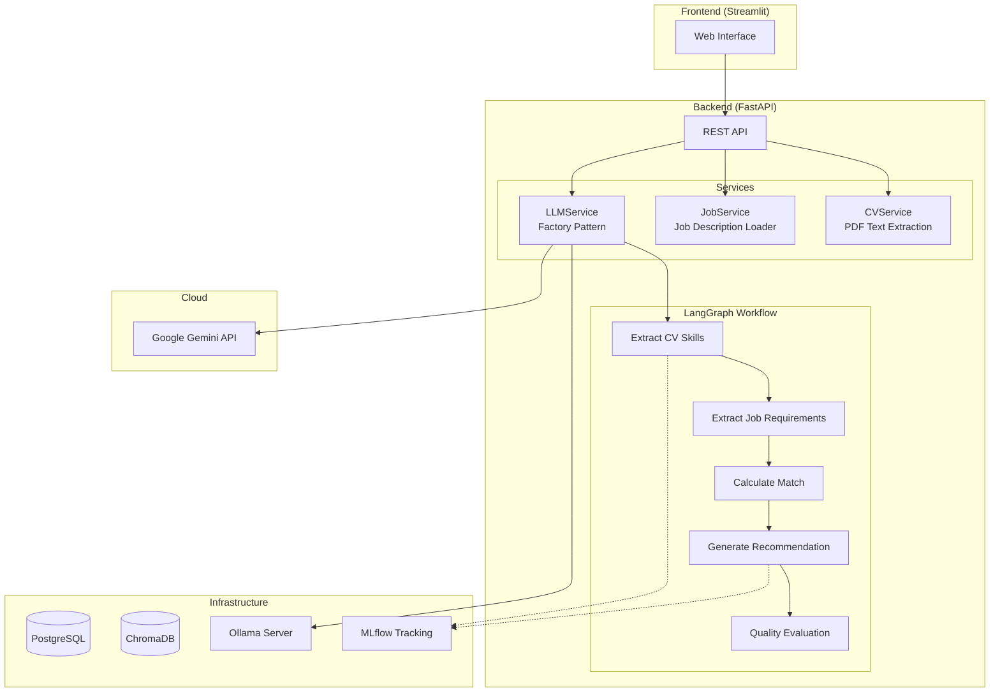

# 🧠 HR AI Filter


An AI-powered recruitment assistant that analyzes CVs against job descriptions using **LLMs** and a multi-step **LangGraph workflow**.

---

## 📋 Table of Contents

- [What It Does](#-what-it-does)
- [Architecture](#-architecture)
- [Tech Stack](#-tech-stack)
- [How It Works](#-how-it-works)
- [Quick Start](#-quick-start)
- [Docker Setup](#-docker-setup)
- [LLM Configuration](#-llm-configuration)
- [CI/CD](#-cicd)
- [Future Improvements](#-future-improvements)

---

## 🎯 What It Does

HR AI Filter automates the CV screening process:

1. **Upload a CV** (PDF) and select a job description
2. **AI extracts skills** from both the CV and job requirements
3. **Calculates match score** between candidate skills and job needs
4. **Generates recommendation** with strengths, weaknesses, and final score
5. **LLM-as-a-judge** validates the recommendation quality

The system tracks all evaluations in **MLflow** for auditability and model improvement.

---

## 🏗 Architecture



### Workflow Pipeline

The core analysis uses **LangGraph** to orchestrate 5 sequential nodes:

| Node | Purpose |
|------|---------|
| `extract_cv_skills` | Parse CV and extract technical skills via LLM |
| `extract_job_requirements` | Parse job description for required skills |
| `calculate_skill_match` | Compute overlap percentage between skills |
| `generate_recommendation` | LLM generates score, summary, strengths, weaknesses |
| `evaluate_quality` | LLM-as-a-judge validates the recommendation (1-5) |

---

## 🛠 Tech Stack

| Layer | Technology | Why |
|-------|------------|-----|
| **Frontend** | Streamlit | Rapid prototyping, Python-native, rich widgets |
| **Backend** | FastAPI | Async, auto-docs (OpenAPI), type hints, fast |
| **PDF Extraction** | pdfplumber | Reliable text extraction from PDF layouts |
| **Workflow Engine** | LangGraph | Composable graphs, state management, retries |
| **LLM Providers** | Gemini / Ollama | Cloud speed + local privacy options |
| **Experiment Tracking** | MLflow | Log metrics, compare runs, audit trail |
| **Vector Store** | ChromaDB | Semantic search (prepared for embeddings) |
| **Database** | PostgreSQL | Production-ready, MLflow backend |
| **Orchestration** | Docker Compose | One-command deployment, service isolation |

### Why This Stack?

- **Python-first**: Backend, frontend, and ML all in Python for consistency
- **LLM Flexibility**: Switch between cloud (Gemini) and local (Ollama) without code changes
- **Observability**: MLflow tracks every evaluation for debugging and improvement
- **Production-ready**: Docker Compose scales from dev laptop to server deployment

---

## ⚙ How It Works

### 1. PDF Text Extraction

```python
# CVService uses pdfplumber
with pdfplumber.open(io.BytesIO(file_bytes)) as pdf:
    pages = [page.extract_text() or "" for page in pdf.pages]
text = clean_text("\n".join(pages))
```

### 2. LLM Provider Factory

```python
# LLMService selects provider based on environment
if provider_name == "gemini":
    self._provider = GeminiProvider()
elif provider_name == "ollama":
    self._provider = OllamaProvider()
```

### 3. LangGraph Workflow

```python
# CVAnalysisGraph defines the pipeline
workflow.add_node("extract_cv_skills", self._extract_cv_skills)
workflow.add_node("extract_job_requirements", self._extract_job_requirements)
workflow.add_node("calculate_skill_match", self._calculate_skill_match)
workflow.add_node("generate_recommendation", self._generate_recommendation)
workflow.add_node("evaluate_quality", self._evaluate_quality)

workflow.set_entry_point("extract_cv_skills")
workflow.add_edge("extract_cv_skills", "extract_job_requirements")
# ... etc
```

### 4. MLflow Tracking

Every analysis logs:
- `cv_skills_count`, `job_requirements_count`
- `skill_match_score`, `score_final`
- `llm_evaluation_score`
- Execution time, model used, job name

---

## 🚀 Quick Start

### 1. Clone & Configure

```bash
git clone https://github.com/ManuelFer92/hr_ai_filter.git
cd hr_ai_filter
cp .env.example .env
# Add your GOOGLE_API_KEY to .env
```

### 2. Add Job Descriptions

Place job description PDFs in:
```
data/jobs/jobs_pdf/
```

### 3. Run with Docker

```bash
docker compose up -d --build
```

### 4. Access Services

| Service | URL |
|---------|-----|
| Frontend | http://localhost:8501 |
| API Docs | http://localhost:8000/docs |
| MLflow UI | http://localhost:5000 |
| pgAdmin | http://localhost:5050 |

---

## 🐳 Docker Setup

The `docker-compose.yml` orchestrates 6 services:

```yaml
services:
  postgres:     # Database for app + MLflow
  pgadmin:      # PostgreSQL web UI
  chroma:       # Vector store (future embeddings)
  ollama:       # Local LLM server
  mlflow:       # Experiment tracking UI
  backend:      # FastAPI application
  frontend:     # Streamlit UI
```

### Key Environment Variables

| Variable | Default | Description |
|----------|---------|-------------|
| `LLM_PROVIDER` | `gemini` | `gemini` or `ollama` |
| `LLM_MODEL` | `gemini-2.5-flash` | Model to use |
| `GOOGLE_API_KEY` | - | Required for Gemini |
| `OLLAMA_HOST` | `http://ollama:11434` | Ollama server URL |

### Volumes

```yaml
volumes:
  postgres_data:   # Persistent database
  chroma_data:     # Vector embeddings
  ollama_data:     # Downloaded models
  mlflow_data:     # Experiment logs
```

---

## 🤖 LLM Configuration

Switch models via the **Frontend UI** or API:

### Gemini (Cloud)
- Fast, reliable, requires `GOOGLE_API_KEY`
- Models: `gemini-2.5-flash`, `gemini-1.5-flash`

### Ollama (Local)
- Private, offline, runs on CPU/GPU
- Models: `gemma2:2b`, `llama3.1:8b`

```bash
# Pull a model manually
docker compose exec ollama ollama pull llama3.1:8b
```

---

## 🔄 CI/CD

GitHub Actions runs on every push to `main` or `develop`:

1. **Sets up Python 3.11** with pip caching
2. **Installs dependencies** (poppler for PDF processing)
3. **Spins up Ollama** as a service container
4. **Runs unit tests** with coverage
5. **Runs E2E tests** against the FastAPI backend

### Run Tests Locally

```bash
cd hr_ai_filter/backend
pytest tests/unit --cov=app
pytest tests/e2e -v
```

---

## 🔮 Future Improvements

| Area | Enhancement |
|------|-------------|
| **Semantic Search** | Use ChromaDB embeddings to find similar candidates |
| **Batch Processing** | Analyze multiple CVs against one job |
| **Multi-language** | Support CVs in English, Spanish, Portuguese |
| **Fine-tuning** | Train on company-specific evaluation criteria |
| **Caching** | Cache LLM responses for repeated analyses |
| **RAG** | Retrieve similar past evaluations for context |
| **Webhooks** | Notify external systems on new evaluations |
| **Authentication** | Add user login and role-based access |

---

## 📁 Project Structure

```
hr_ai_filter/
├── docker-compose.yml        # Service orchestration
├── .github/workflows/ci.yml  # GitHub Actions CI
├── hr_ai_filter/
│   ├── backend/
│   │   ├── app/
│   │   │   ├── main.py           # FastAPI entrypoint
│   │   │   ├── routers/          # API endpoints
│   │   │   ├── services/         # Business logic
│   │   │   ├── llm_providers/    # Gemini & Ollama
│   │   │   └── graphs/           # LangGraph workflows
│   │   └── tests/                # Unit & E2E tests
│   └── frontend/
│       └── app.py                # Streamlit UI
└── data/
    └── jobs/jobs_pdf/            # Job description PDFs
```

---

## 📄 License

MIT License - See [LICENSE](LICENSE) for details.
