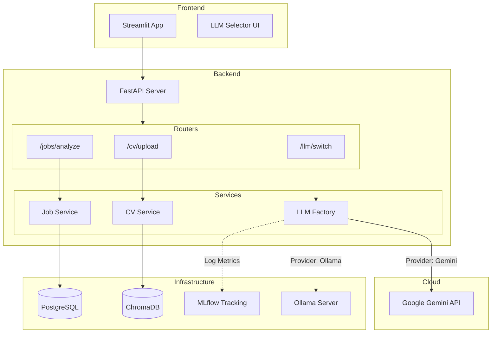

# 🧠 HR AI Filter

An AI-powered recruitment assistant that filters CVs against job descriptions using **LLMs (Gemini/Ollama)** and **semantic search**.


## 🚀 Features

- **📄 CV Analysis**: Extract and analyze text from PDF resumes.
- **🤖 Multi-LLM Support**: Switch dynamically between **Google Gemini** (Cloud) and **Ollama** (Local).
- **📊 MLflow Tracking**: Track every evaluation, prompt, and score.
- **🔍 Vector Search**: Semantic matching using ChromaDB (coming soon).
- **🐳 Fully Dockerized**: Ready to deploy with a single command.

## 🛠️ Quick Start

### 1. clone the repo
```bash
git clone https://github.com/your-username/hr_ai_filter.git
cd hr_ai_filter
```

### 2. Configure Environment
Copy the example file and add your API key:
```bash
cp .env.example .env
nano .env  # Add GOOGLE_API_KEY=your_key_here
```

### 3. Add Jobs
Copy the pdf os job description to the `data/jobs/jobs_pdf` directory.

### 4. Run with Docker 🐳
Start the full stack (Frontend, Backend, DB, MLflow):
```bash
docker compose up -d --build
```
> **Note:** The backend restarts automatically to apply configuration changes.

### 4. Access Services
- **Frontend**: [http://localhost:8501](http://localhost:8501)
- **MLflow UI**: [http://localhost:5000](http://localhost:5000)
- **API Docs**: [http://localhost:8000/docs](http://localhost:8000/docs)

## 🧩 Project Structure

```
├── docker-compose.yml       # Service orchestration
├── hr_ai_filter/
│   ├── backend/             # FastAPI App
│   │   ├── app/
│   │   │   ├── llm_providers/  # Gemini & Ollama implementations
│   │   │   ├── routers/        # API Endpoints
│   │   │   └── services/       # Core Logic
│   └── frontend/            # Streamlit App
└── data/                    # Storage for CVs and Jobs
```


## 🏗️ Architecture



## 🤖 LLM Configuration

You can switch models directly from the **Frontend UI**:

- **Gemini (Default)**: Fast & efficient. Requires `GOOGLE_API_KEY`.
  - Models: `gemini-2.5-flash`, `gemini-1.5-flash`
- **Ollama (Local)**: Private & offline.
  - Models: `gemma2:2b` (auto-downloads), `llama3.1:8b`
